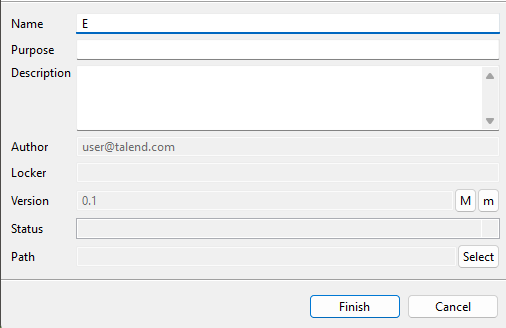

# Membuat Data Warehouse untuk kebutuhan salah satu client ID/X Partners
    Repository ini dibuat untuk memenuhi Final Project Virtual Internship Experience Rakamin x ID/X Partners sebagai Data Engineer.

# Challenge
Salah satu client dari ID/X Partners yang bergerak di bidang e-commerce memiliki kebutuhan untuk membuat sebuah Data Warehouse yang berasal dari beberapa tabel dari database sumber. Data Warehouse ini nantinya terdiri dari satu tabel Fact dan beberapa tabel Dimension.

Sebagai Data Engineer, ada beberapa task yang perlu anda lakukan
yaitu :
1. **Melakukan Import/Restore Database Staging.**
2. **Membuat sebuah Database bernama DWH_Project, serta membuat Tabel Fact dan Dimension dari tabel yang ada di database Staging.**
3. **Membuat Job ETL di aplikasi talend untuk memindahkan data dari Staging ke Data Warehouse.** Khusus untuk Tabel DimCustomer, lakukan transformasi data dengan merubah data dari kolom FirstName dan LastName menjadi huruf kapital semua, lalu gabungkan kedua kolom tersebut menjadi satu kolom yang bernama CustomerName.
4. **Membuat Store Procedure (SP) untuk menampilkan summary sales order berdasarkan status pengiriman.**

# Prerequisite
1. Pastikan Database SQL Server dan SSMS (SQL Server Management Studio) sudah terinstall.
2. Pastikan aplikasi Talend sudah terinstall.
3. File backup database (Staging.bak).

# Hints
1. Lakukan **restore database** menggunakan file **Staging.bak**. Di dalam database tersebut akan ada 3 tabel master yaitu tabel **customer, product, status_order** dan ada 1 tabel transaksi yaitu tabel **sales_order**.
2. Bisa gunakan perintah CREATE untuk **membuat tabel** atau manual menggunakan fitur di SSMS dan berilah nama tabel dimension dengan nama **DimCustomer, DimProduct, DimStatusOrder** dan tabel Fact dengan nama **FactSalesOrder**. Untuk **nama-nama kolom dan tipe data** dari setiap tabel, **ikuti saja dengan yang ada di staging**, hanya saja penulisan nama kolom tidak pakai underscrore dan setiap kata awalannya pakai huruf kapital (Pascal Case) misal **customer_id = CustomerID, product_name = ProductName**. Jangan lupa juga **memberi primary key dan foreign key** pada setiap tabel Fact dan Dimension. Untuk referensi bisa lihat disini https://www.w3schools.com/sql/sql_primarykey.asp dan https://www.w3schools.com/sql/sql_foreignkey.asp
3. Buat job di talend **menggunakan komponen tMSSqlInput dan tMSSqlOutput** untuk memindahkan data dari source (staging) ke target (DWH_Project). Namun, **khusus untuk tabel DimCustomer, tambah satu komponen lagi yaitu tMap** untuk melakukan transformasi sesuai dengan ketentuan soal. Di dalam tMap pakai fungsi UPCASE untuk membuat huruf menjadi kapital semua, lalu untuk menggabungkan kedua kolom bisa pakai operator plus (+). Fungsi-fungsi tersebut sudah tersedia di dalam komponen tMap.
4. **Buatlah SP bernama summary_order_status** yang berisi perintah SELECT dan lakukan JOIN antara tabel fact dan dimension untuk menampilkan beberapa kolom yaitu **OrderID, CustomerName, ProductName, Quantity, StatusOrder**. Buatlah parameter bernama StatusID dari kolom StatusID (tabel DimStatusOrder) sebagai filter dari query tersebut. Jadi ketika kita ingin jalankan SP tersebut sintaksnya seperti ini EXEC summary_order_status @StatusID = ???

# Procedure:
## Restore Database
Hal pertama yang perlu dilakukan adalah me-restore database Staging.

* Buka SSMS > Connect to Server


* Klik kanan pada Databases > Restore Database


* Pilih Device > Klik tombol ... di sebelah kanan


* Add


* Pilih Staging.bak > OK > OK

Sebelumnya, copy file Staging.bak ke directory C:\Program Files\Microsoft SQL Server\MSSQL16.MSSQLSERVER\MSSQL\Backup


## Create DWH_Project Database

* Klik kanan pada Databases > New Database


* Isi Nama Database dengan DWH_Project > OK


## Create Tables pada Database DWH_Project

```Sql
CREATE TABLE DimCustomer(
	CustomerId INT PRIMARY KEY,
	FirstName VARCHAR(50) NOT NULL,
	LastName VARCHAR(50) NOT NULL,
	CustomerName VARCHAR(50) NOT NULL,
	Age INT NOT NULL,
	Gender VARCHAR(50) NOT NULL,
	City VARCHAR(50) NOT NULL,
	NoHP VARCHAR(50) NOT NULL
);

CREATE TABLE DimProduct(
	ProductId INT PRIMARY KEY,
	ProductName VARCHAR(255) NOT NULL,
	ProductCategory VARCHAR(255) NOT NULL,
	ProductUnitPrice INT
);

CREATE TABLE DimStatusOrder(
	StatusId INT PRIMARY KEY,
	StatusOrder VARCHAR(50) NOT NULL,
	StatusOrderDesc VARCHAR(50) NOT NULL
);

CREATE TABLE FactSalesOrder(
	OrderId INT PRIMARY KEY,
	CustomerId INT,
	ProductId INT,
	Quantity INT NOT NULL,
	Amount INT NOT NULL,
	StatusId INT,
	OrderDate date NOT NULL,
	FOREIGN KEY(CustomerId) REFERENCES DimCustomer(CustomerId),
	FOREIGN KEY(ProductId) REFERENCES DimProduct(ProductId),
	FOREIGN KEY(StatusId) REFERENCES DimStatusOrder(StatusId)
);
```

## Setting Security
Secara default, server authentication hanya menerima Windows Authentication mode, sehingga perlu diubah menjadi SQL Server and Windows Authentication mode

* Klik kanan pada Server > Properties


* Klik Menu Security > pada Server authentication pilih SQL Server and Windows Authentication mode > OK


## Add Login Credential

* Klik kanan Logins > New Login


* Pada menu general, masukkan login name (bebas), password (bebas), dan uncheck Enforce password expiration


* Pada menu Server Roles, berikan akses yang sesuai > OK


## Setting Protocols

* Buka Sql Server Configuration Manager > pilih menu Protocols for MSSQLSERVER


* Klik kanan TCP/IP > Enable


* Buka menu SQL Server Services


* Klik kanan SQL Server (MSSQLSERVER) > Restart 


## Create New Project Talend

* Isi nama project (bebas) > Create


* Pilih project yang baru saja dibuat pada bagian Select an existing project > Finish


## Create Connection di Talend
Buat 2 connections untuk connect ke database Staging dan DWH_Project

* Pada menu Metadata, klik kanan pada Db Connections > Create connection


* Isi nama (bebas) > Next


* Isi kolom sebagai berikut:
  * DB Type = Microsoft SQL Server
  * Db Version = Open source JTDS (bisa menggunakan Microsoft, namun butuh library tambahan)
  * Login = Isi sesuai dengan login credential yang dibuat sebelumnya
  * Password = Isi sesuai dengan login credential yang dibuat sebelumnya
  * Server = Sesuaikan dengan machine masing-masing atau gunakan 'localhost'
  * Port = leave it as default
  * Database = Staging


Test connection untuk menguji apakah kredensial dapat digunakan untuk koneksi dengan database, jika bisa klik Finish. Lakukan hal yang sama kecuali untuk bagian Database diisi dengan DWH_Project. Jika sudah maka akan muncul 2 connections seperti di bawah ini.


## Retrieve Schema
Optional namun dapat membantu untuk mengisi schema database nanti.

* Klik kanan pada koneksi > Retrieve Schema


* Klik Next


* Dalam Staging (Database) > dbo (Schema) > Pilih 4 tabel yang ada di dalam database tersebut > Next > Finish


Lakukan hal yang sama pada koneksi yang satunya (DWH_Project)

## Create Job di Talend

* Klik kanan pada Job Designs > Create job


* Isi nama (bebas) > Finish



* Pada menu bagian kanan (Palette), drag and drop komponen yang dibutuhkan:
  * tMSSqlInput
  * tMSSqlOutput
  * tMap


### Setting tMSSqlInput
tMSSqlInput berfungsi sebagai input, specify the table/database as input

Isi kolom sebagai berikut:
  * Property Type = Repository, lalu pilih koneksi yang telah dibuat sebelumnya dengan menekan tombol ... di sebelah kanan
  * Schema = Repository, , lalu pilih schema yang telah didapatkan sebelumnya dengan menekan tombol ... di sebelah kanan
  * Query = Select all


### Setting tMSSqlOutput
Sama dengan tMSSqlInput, specify the table/database as output


Pada tabel lain selain DimCustomer, tMSSqlInput akan dihubungkan langsung dengan tMSSqlOutput sehingga perlu dilakukan penyesuaian pada nama kolom tabel seperti pada contoh di bawah:

* Tekan tombol ... di sebelah kanan Edit schema > Change to built-in property.


* Column di sebelah kanan harus sesuai dengan Db Column yang ada di sebelah kiri. Db Column di sebelah kanan, harus sesuai dengan kolom tabel yang akan dituju


### Setting tMap
tMap digunakan untuk proses transformasi data. Kolom CustomerName pada tabel DimCustomer adalah bentuk kapital dari first_name + (space) + last_name.

* Klik 2x pada tMap, drag and drop kolom sebelah kiri ke kolom yang sesuai di sebelah kanan. Untuk bagian CustomerName isi menggunakan expression:
```Sql
StringHandling.UPCASE(row1.first_name + ' ' + row1.last_name)
```


* Jika sudah diatur semua, maka jalankan job dengan pergi ke menu Run (Job ETL) dan klik Run


## Create Store Procedure
Setelah Database DWH_Project sudah terisi, terakhir adalah membuat store procedure. Query nya adalah sebagai berikut:
```Sql
CREATE PROCEDURE GetSalesOrdersByStatus
	@StatusId INT
AS
BEGIN
	SELECT
		f.OrderId,
		c.CustomerName,
		p.ProductName,
		f.Quantity,
		s.StatusOrder
	FROM FactSalesOrder f
	JOIN DimCustomer c ON f.CustomerId = c.CustomerId
	JOIN DimProduct p ON f.ProductId = p.ProductId
	JOIN DimStatusOrder s ON f.StatusId = s.StatusId
	WHERE s.StatusId = @StatusId;
END;
```

Dan untuk menggunakannya,
```Sql
EXEC GetSalesOrdersByStatus @StatusId = 3; -- isi dengan StatusId
```

Hasil:


# Thank you